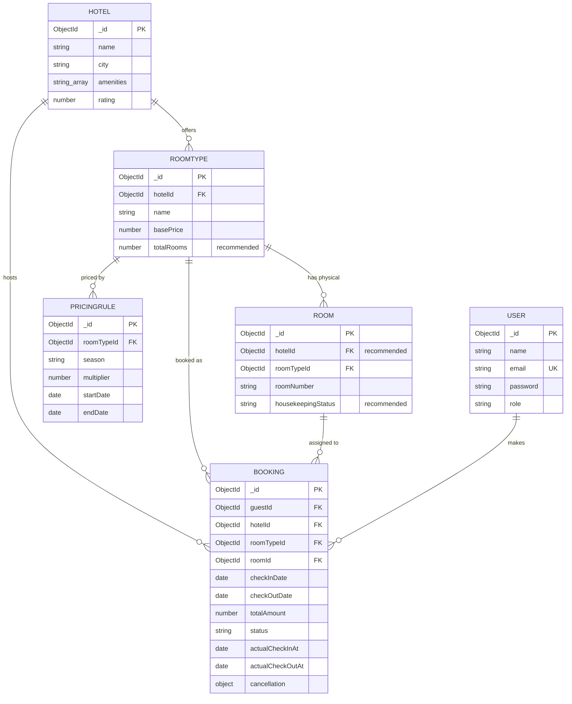

# Stayo — Unified Database Schema Design

**Database technology:** MongoDB (Mongoose ODM).
Evidence: `Member3.txt` (`bookingController.js`) does `require('../models/Booking')`, `Room.find()`, `RoomType.findById()`, `Booking.create()`, `booking.save()`, `.populate(...)` — all Mongoose APIs. The project objectives ("Model hotels, room types, and date‑based availability in **MongoDB**") confirm this.

> ⚠️ **Important caveat:** Member 1 and Member 2 only supplied **Postman collections**, not their actual model files. Member 3 supplied a real controller that *references* `Room`, `RoomType`, `Booking`, `PricingRule` models but the model files themselves were not shared. Everything below for `User`, `Hotel`, `RoomType`, and `Room` is **reverse‑engineered from field usage in the code/requests**, not copied from an existing schema file. Fields that are not directly proven by the code are explicitly marked **(recommended)** — remove or confirm them with Members 1–3 before finalizing.

---

## 1. Entity / Collection List

| # | Collection | Owner (per code evidence) | Confirmed by |
|---|-----------|---------------------------|--------------|
| 1 | `users` | Member 1 | `Auth/Register`, `Auth/Login` bodies; `req.user.userId`, `req.user.role` in Member 3's controller |
| 2 | `hotels` | Member 1 | `Hotels/Create Hotel`, `Hotels/Get Hotels`; `roomType.hotelId`, `booking.hotelId` in controller |
| 3 | `roomtypes` | Member 1 | `RoomType.findById(roomTypeId)`, `roomType.basePrice`, `roomType.hotelId`, `roomType.name` in controller; `Pricing Rules` body `roomTypeId` |
| 4 | `rooms` | Member 1 | `Room.find({roomTypeId})`, `r._id`, `r.roomNumber`; `Rooms/Delete Room` |
| 5 | `pricingrules` | Member 2 | `PricingRule.find({roomTypeId})` in controller; full CRUD in Member 2's collection |
| 6 | `bookings` | Member 2 (API) / Member 3 (implementation) | Full `bookingController.js` |

No separate collections exist yet in the provided code for **Housekeeping status**, **Invoices**, or **Occupancy reports** (modules 8, 12, 13) — see §7 "Gaps".

---

## 2. Fields, Types, Keys

### 2.1 `users`
| Field | Type | Notes |
|---|---|---|
| `_id` | ObjectId (PK) | |
| `name` | String, required | from Register body |
| `email` | String, required, **unique index** | login key |
| `password` | String, required | must be hashed (bcrypt) before save — not verifiable from the txt files, flag for Member 1 to confirm |
| `role` | String, enum: `guest`, `staff`, `admin`, default `guest` | used in `req.user.role` checks in `bookingController.js` |
| `createdAt`, `updatedAt` | Date (timestamps) | (recommended) |

⚠️ **Security flag:** The `Register` request lets the caller pass `"role": "admin"` directly in the body with no restriction visible in the collection. If the live code doesn't force `role: "guest"` on public self‑registration, **any user can register as admin**. Flag this for Member 1 to confirm/fix — it should be a documented "Known Issue" if not fixed before submission.

### 2.2 `hotels`
| Field | Type | Notes |
|---|---|---|
| `_id` | ObjectId (PK) | |
| `name` | String, required | |
| `city` | String, required | used as a search/filter field conceptually |
| `amenities` | [String] | e.g. `["WiFi","Pool"]` |
| `rating` | Number (1–5) | |
| `createdBy` | ObjectId ref `users` | **(recommended)** — not in the request body, but sensible for an Admin-managed resource |
| `createdAt`, `updatedAt` | Date | **(recommended)** |

### 2.3 `roomtypes`
| Field | Type | Notes |
|---|---|---|
| `_id` | ObjectId (PK) | |
| `hotelId` | ObjectId ref `hotels`, required | proven by `roomType.hotelId` used to set `booking.hotelId` |
| `name` | String, required | proven by `.populate('roomTypeId','name basePrice')` |
| `basePrice` | Number, required | proven by `calculateBookingPrice(roomType.basePrice, ...)` |
| `description` | String | **(recommended)** |
| `capacity` (max guests) | Number | **(recommended)** — Member 1's `Search Hotels` request takes a `guests` query param but no code was supplied showing it's actually matched against a capacity field. Flag: confirm with Member 1 whether `guests` is currently used at all in the search logic. |
| `totalRooms` / `count` | Number | **(recommended)** — Objective #1 explicitly says "room types, **count**...", but no code shows this field being read or written anywhere. This is a real gap, not just an omission in my design — see §7. |

### 2.4 `rooms`
| Field | Type | Notes |
|---|---|---|
| `_id` | ObjectId (PK) | |
| `hotelId` | ObjectId ref `hotels` | **(recommended)** — not directly read in the given code (rooms are looked up only via `roomTypeId`), but useful for direct hotel‑level queries and matches the objective "Model hotels, room types, and date‑based availability" |
| `roomTypeId` | ObjectId ref `roomtypes`, required | proven: `Room.find({ roomTypeId })` |
| `roomNumber` | String/Number, required | proven: `.populate('roomId','roomNumber')` |
| `housekeepingStatus` | String, enum: `clean`, `dirty`, `maintenance` | **(recommended)** — required for Module 8 (Housekeeping Status Tracking), which has no code yet |
| `createdAt`, `updatedAt` | Date | **(recommended)** |

### 2.5 `pricingrules`
| Field | Type | Notes |
|---|---|---|
| `_id` | ObjectId (PK) | |
| `roomTypeId` | ObjectId ref `roomtypes`, required | |
| `season` | String | e.g. `"weekend"` |
| `multiplier` | Number, required | e.g. `1.5` |
| `startDate` | Date, required | |
| `endDate` | Date, required | |
| `createdAt`, `updatedAt` | Date | **(recommended)** |

### 2.6 `bookings`
| Field | Type | Notes |
|---|---|---|
| `_id` | ObjectId (PK) | |
| `guestId` | ObjectId ref `users`, required | `req.user.userId` |
| `hotelId` | ObjectId ref `hotels`, required | denormalized from `roomType.hotelId` at creation time (proven in code) |
| `roomTypeId` | ObjectId ref `roomtypes`, required | |
| `roomId` | ObjectId ref `rooms`, required | auto‑assigned by availability logic |
| `checkInDate` | Date, required | |
| `checkOutDate` | Date, required | |
| `totalAmount` | Number, required | from `calculateBookingPrice()` |
| `status` | String, enum: `Reserved`, `Confirmed`, `Checked-in`, `Checked-out`, `Cancelled`; default `Reserved` | enforced via `STATUS_TRANSITIONS` map |
| `actualCheckInAt` | Date | set on check‑in |
| `actualCheckOutAt` | Date | set on check‑out |
| `cancellation.cancelledAt` | Date | |
| `cancellation.reason` | String, default `"Not specified"` | |
| `cancellation.refundAmount` | Number | from `calculateRefund()` |
| `createdAt`, `updatedAt` | Date (timestamps) | proven: `.sort({ createdAt: -1 })` |

---

## 3. Relationships & Cardinality

```
User (guest)   1 ────< N  Booking
Hotel          1 ────< N  RoomType
Hotel          1 ────< N  Booking      (denormalized FK for fast reporting)
RoomType       1 ────< N  Room
RoomType       1 ────< N  PricingRule
RoomType       1 ────< N  Booking
Room           1 ────< N  Booking      (a room can have many bookings over time, but only
                                         non-overlapping ones may be "active" at once)
```

- A **Hotel** has many **RoomTypes**; a **RoomType** belongs to exactly one Hotel.
- A **RoomType** has many physical **Rooms**; a **Room** belongs to exactly one RoomType.
- A **RoomType** can have many **PricingRules** (different seasons/date windows).
- A **Booking** references one **User** (guest), one **Hotel**, one **RoomType**, and one specific **Room** — all four are denormalized onto the booking for query/report convenience, even though `hotelId`/`roomTypeId` are technically derivable via `roomId → roomtype → hotel`.

---

## 4. Constraints & Business Rules (as actually implemented)

1. **Unique email** — `users.email` must be unique (login relies on it).
2. **Date validation** — `checkInDate < checkOutDate`, and `checkInDate` cannot be before today (`INVALID_DATE_RANGE`, 400).
3. **Double‑booking prevention** — *not* a DB constraint; it's an **application‑level query** in `createBooking`:
   - Find all rooms of the requested `roomTypeId`.
   - Find bookings on those rooms with `status ∈ {Reserved, Confirmed, Checked-in}` where `checkInDate < requestedCheckOut AND checkOutDate > requestedCheckIn` (classic interval overlap).
   - Assign the first room not in that overlapping set.
   - ⚠️ Race condition: two simultaneous requests could both pass this check before either `Booking.create()` commits, since there's no transaction or unique partial index. **Recommend:** wrap in a Mongo transaction, or add a secondary uniqueness safeguard (e.g., optimistic retry) before the viva if asked about concurrency.
4. **Status transitions are a finite state machine**, enforced centrally by `STATUS_TRANSITIONS`:
   `Reserved → {Confirmed, Cancelled}`, `Confirmed → {Checked-in, Cancelled}`, `Checked-in → {Checked-out}`, `Checked-out → {}`, `Cancelled → {}`. Any other transition → `409 INVALID_STATUS_TRANSITION`.
5. **Authorization rules**:
   - `getBooking`/`cancelBooking`: allowed if `guestId === req.user.userId` OR role is `staff`/`admin`; else `403 FORBIDDEN`.
   - `confirmBooking`, `checkInBooking`, `checkOutBooking`: staff/admin only (per Member 2's collection headers, using `staffToken`).
6. **Refund** is computed by `calculateRefund(totalAmount, checkInDate, cancelledAt)` — **the function body wasn't supplied**, so its exact refund‑percentage rule (e.g., tiered by days‑before‑checkin) is unverified. Get this file from Member 3 before writing the DB "business rules" slide/README section as fact.
7. **Pricing** is computed by `calculateBookingPrice(basePrice, checkIn, checkOut, pricingRules)` — also **not supplied**. Unverified: whether overlapping pricing rules stack multiplicatively, take the max, or the code assumes non‑overlapping rules. Flag for Member 2/3.

### Recommended indexes (not yet in code, add for correctness/performance)
```js
users:        { email: 1 } unique
rooms:        { hotelId: 1, roomTypeId: 1 }
roomtypes:    { hotelId: 1 }
pricingrules: { roomTypeId: 1, startDate: 1, endDate: 1 }
bookings:     { roomId: 1, status: 1, checkInDate: 1, checkOutDate: 1 }   // speeds up overlap query
bookings:     { guestId: 1, createdAt: -1 }                              // speeds up "Guest Booking History" (module 11)
bookings:     { hotelId: 1, status: 1 }                                   // speeds up "Admin Occupancy Reports" (module 13)
```

---

## 5. ER Diagram (Mermaid)



---

## 6. Mongoose Schema (implementable)

```js
// models/User.js
const userSchema = new Schema({
  name: { type: String, required: true },
  email: { type: String, required: true, unique: true, lowercase: true, trim: true },
  password: { type: String, required: true },
  role: { type: String, enum: ['guest', 'staff', 'admin'], default: 'guest' }
}, { timestamps: true });

// models/Hotel.js
const hotelSchema = new Schema({
  name: { type: String, required: true },
  city: { type: String, required: true },
  amenities: [{ type: String }],
  rating: { type: Number, min: 1, max: 5 },
  createdBy: { type: Schema.Types.ObjectId, ref: 'User' } // recommended
}, { timestamps: true });

// models/RoomType.js
const roomTypeSchema = new Schema({
  hotelId: { type: Schema.Types.ObjectId, ref: 'Hotel', required: true },
  name: { type: String, required: true },
  basePrice: { type: Number, required: true },
  description: { type: String },          // recommended
  capacity: { type: Number },              // recommended
  totalRooms: { type: Number }             // recommended
}, { timestamps: true });

// models/Room.js
const roomSchema = new Schema({
  hotelId: { type: Schema.Types.ObjectId, ref: 'Hotel' },       // recommended
  roomTypeId: { type: Schema.Types.ObjectId, ref: 'RoomType', required: true },
  roomNumber: { type: String, required: true },
  housekeepingStatus: { type: String, enum: ['clean', 'dirty', 'maintenance'], default: 'clean' } // recommended
}, { timestamps: true });
roomSchema.index({ hotelId: 1, roomNumber: 1 }, { unique: true }); // recommended

// models/PricingRule.js
const pricingRuleSchema = new Schema({
  roomTypeId: { type: Schema.Types.ObjectId, ref: 'RoomType', required: true },
  season: { type: String },
  multiplier: { type: Number, required: true },
  startDate: { type: Date, required: true },
  endDate: { type: Date, required: true }
}, { timestamps: true });

// models/Booking.js
const bookingSchema = new Schema({
  guestId: { type: Schema.Types.ObjectId, ref: 'User', required: true },
  hotelId: { type: Schema.Types.ObjectId, ref: 'Hotel', required: true },
  roomTypeId: { type: Schema.Types.ObjectId, ref: 'RoomType', required: true },
  roomId: { type: Schema.Types.ObjectId, ref: 'Room', required: true },
  checkInDate: { type: Date, required: true },
  checkOutDate: { type: Date, required: true },
  totalAmount: { type: Number, required: true },
  status: {
    type: String,
    enum: ['Reserved', 'Confirmed', 'Checked-in', 'Checked-out', 'Cancelled'],
    default: 'Reserved'
  },
  actualCheckInAt: Date,
  actualCheckOutAt: Date,
  cancellation: {
    cancelledAt: Date,
    reason: { type: String, default: 'Not specified' },
    refundAmount: Number
  }
}, { timestamps: true });

bookingSchema.index({ roomId: 1, status: 1, checkInDate: 1, checkOutDate: 1 });
bookingSchema.index({ guestId: 1, createdAt: -1 });
bookingSchema.index({ hotelId: 1, status: 1 });
```

---

## 7. Code‑to‑Database Mapping

| Controller function (Member 3) | Collections touched |
|---|---|
| `createBooking` | reads `RoomType`, `Room`, `Booking` (overlap check), `PricingRule`; writes `Booking` |
| `getBookings` | reads `Booking` (+ populates `User`, `RoomType`, `Room`) |
| `getBooking` | reads `Booking` (+ populates) |
| `confirmBooking` | reads/writes `Booking.status` |
| `checkInBooking` | reads/writes `Booking.status`, `Booking.actualCheckInAt` |
| `checkOutBooking` | reads/writes `Booking.status`, `Booking.actualCheckOutAt` |
| `cancelBooking` | reads/writes `Booking.status`, `Booking.cancellation.*` |

| Postman request (Member 1) | Implies collection(s) |
|---|---|
| `Auth/Register`, `Auth/Login` | `User` |
| `Hotels/Create Hotel`, `Get Hotels` | `Hotel` |
| `Rooms/Delete Room` | `Room` |
| `Availability Search/Search Hotels` | `Room`, `RoomType`, `Booking` (must run the same overlap logic as `createBooking` to know what's free) |

| Postman request (Member 2) | Implies collection(s) |
|---|---|
| `Pricing Rules/*` (CRUD) | `PricingRule` |
| `Bookings/*` | `Booking` (implementation lives in Member 3's controller) |

---

## 8. Changes Required in Existing Code for Integration

1. **Missing model source files.** Member 1 & 2 never shared `models/User.js`, `Hotel.js`, `RoomType.js`, `Room.js`. These must exist (Member 3's controller imports `Room` and `RoomType` successfully), but I can't verify their exact field names beyond what's used. **Action:** get these 4 files from Member 1 and diff them against §2 before you present the schema as final.
2. **Add `hotelId` directly on `Room`** (currently only reachable via `roomTypeId → hotelId`) to avoid an extra join/populate chain when doing per‑hotel housekeeping/occupancy queries (modules 8 & 13).
3. **Add `totalRooms`/`count` to `RoomType`** — required by the stated objective but currently absent from any provided code.
4. **Lock down `role` on public registration** — either strip `role` from the public `/api/auth/register` body server‑side or add an admin‑only "create staff" endpoint, otherwise the auth/role‑separation objective is not actually enforced.
5. **Add indexes** listed in §4 — none currently exist in the provided code.
6. **Get `pricingCalculator.js` and `refundCalculator.js`** from Member 3 to confirm the actual pricing/refund business rules before documenting them as fact in the README/PPT.
7. **Endpoint naming mismatch:** `Availability Search → Search Hotels` actually searches **rooms within one hotel** (`hotelId` is a required query param, singular), not "search across hotels". Either rename the endpoint or extend it to support searching without a fixed `hotelId` — confirm intended behavior with Member 1.

---

## 9. Gaps vs. the 13 Required Modules (for your own tracking)

| # | Module | Code coverage found |
|---|---|---|
| 1 | Guest Registration & Authentication | ✅ Register/Login present |
| 2 | Hotel & Property Management | ⚠️ Create/Get only — no Update/Delete Hotel |
| 3 | Room Type & Inventory Management | ⚠️ Only "Delete Room" exists; no Create/Get/Update Room or RoomType endpoints in Member 1's collection |
| 4 | Availability Search Engine | ✅ present (naming caveat above) |
| 5 | Reservation Booking Workflow | ✅ `createBooking` |
| 6 | Dynamic Pricing Rules | ✅ CRUD present; calculation logic file not supplied |
| 7 | Booking Status Management | ✅ `STATUS_TRANSITIONS` engine |
| 8 | Check‑in / Check‑out | ✅ present |
| 9 | Housekeeping Status Tracking | ❌ no code at all |
| 10 | Cancellation & Refund Policy Engine | ⚠️ `cancelBooking` present; `refundCalculator.js` logic not supplied |
| 11 | Guest Booking History | ❌ no dedicated endpoint (could reuse `getBookings` with a `guestId` filter, but that's not currently supported by the query params shown) |
| 12 | Invoice Generation Summary | ❌ no code |
| 13 | Admin Occupancy Reports | ❌ no code |

This table is the most useful thing to walk into your next team sync with — modules 9, 11, 12, 13 are effectively unbuilt, and module 3 needs real endpoints, not just Delete.
